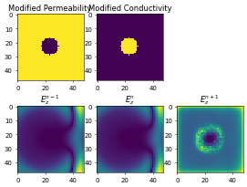
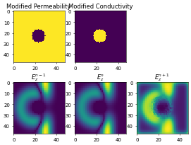
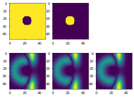

# DNN-2d-FDTD
## Dynamics

## Breif Introduction
This project contains multiple subprojects towards using DNN to simulate the behavior of 2D FDTD. Multiple network architecure are tries:
* 3D-CNN + LSTM with Encoder & Decoder
* ConvLSTM with Decoder
* CNN Encoder & Decoder
* LSTM with Encoder & Decoder

## Figures
training epoch70:

training epoch120:

training epoch11000:

training loss:

All networks in this are light-weight and can be trained on GTX 1050 Laptop.
